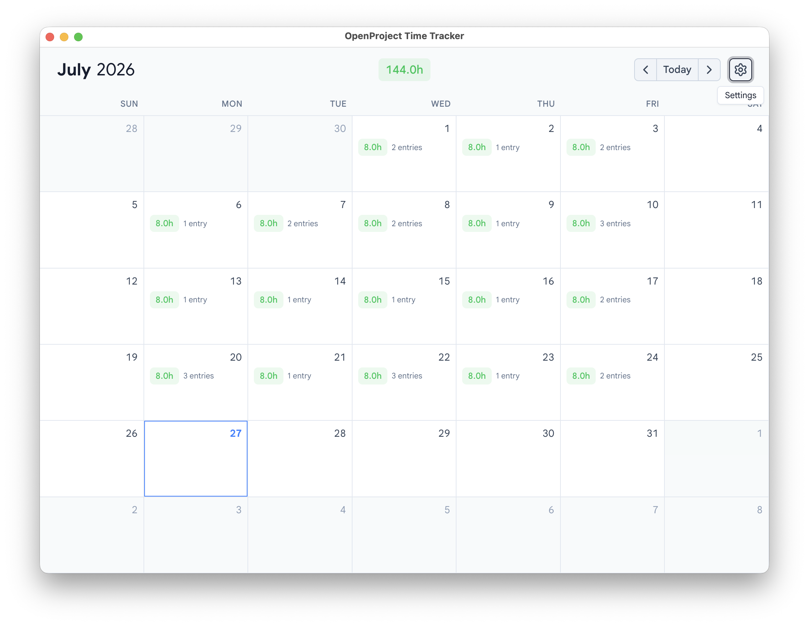

# OpenProject Time Tracker

Electron desktop app for tracking OpenProject time entries. Vue 3 + TypeScript renderer bundled via Vite (`electron-vite`).

---

# User guide

A month calendar over your own OpenProject time entries: see at a glance which
days are short, click a day to log against it. It talks to nothing but your
OpenProject server.



## 1. Install

> ### ⬇ [Download the latest release](https://github.com/tammai/op-time-tracker/releases/latest)
>
> | Platform | Grab this file |
> |---|---|
> | **macOS** — Apple Silicon or Intel | `OP.Time.Tracker-<version>-universal.dmg` |
> | **Windows 10/11** — x64 | `OP.Time.Tracker-<version>-x64-setup.exe` |
>
> Prefer not to mount a disk image on macOS? Take the `-universal-mac.zip`
> instead — same app.

Then, first launch only:

| Platform | What to do |
|---|---|
| macOS | Open the DMG, drag the app to **Applications**, then **right-click → Open → Open**. |
| Windows | Run the installer, then **More info → Run anyway** at the SmartScreen prompt. Installs for your user only — no admin password. |

Both builds are unsigned, so each OS warns once on first launch. That's expected;
[the reason is below](#the-builds-are-unsigned--what-recipients-see). You only do
it once per install — after that the app opens normally.

## 2. Connect to OpenProject

On first run you get a **Connect to OpenProject** screen with two fields.

- **OpenProject base URL** — your instance, e.g. `https://op.bigin.vn`.
- **API key** — in OpenProject: avatar → **My account** → **Access tokens** →
  generate an **API** token. Copy it before closing the dialog; OpenProject
  shows it once. (Older versions label this "API key".)

Hit **Test connection** to check the pair, then **Save & continue**.

Your key is stored in the OS keychain (Keychain on macOS, DPAPI on Windows),
encrypted, on your machine only. It's never sent anywhere except your own
OpenProject server.

## 3. The calendar

One screen: the month, with a header row above it.

- **Header** — month and year on the left, the **month total** in the middle,
  `‹ Today ›` navigation and the ⚙ settings button on the right.
- **Each day** shows its logged total and entry count. A day with nothing logged
  shows just its number. Today's cell is outlined.
- **The total's colour is the point:**

  | Colour | Meaning |
  |---|---|
  | 🟡 Amber | Under 8h — the day is short |
  | 🟢 Green | Exactly 8h |
  | 🔴 Red | Over 8h |

Only days in the displayed month are clickable — greyed leading/trailing days
belong to the neighbouring month, so use `‹` / `›` to get to them.

Everything shown is **your** time only. Entries your colleagues logged against
the same work packages don't appear.

## 4. Log time

Click a day. The day modal opens with a form on top and that day's entries below.

1. **Work package** — the dropdown starts with your own open items (status
   *In Progress* or *To Do*, most relevant first). Type to filter them. To reach
   anything else — someone else's item, a closed one — type its **full 5-digit
   ID** and the app fetches it directly.
2. **Activity** — required by OpenProject, and the available options depend on
   the work package's project, so pick the work package first.
3. **Hours** — defaults to `1`, moves in quarter-hour steps, minimum `0.25`.
   New entries cap at `8`; typing more snaps back down.
4. **Comment** — optional.

**Log time** saves it, and the calendar and the day's list both update at once.
The form then keeps your work package and activity but resets hours to `1` and
clears the comment — so logging a second slot against the same item is just
hours, comment, save.

## 5. Fix what's already logged

Each row under **Logged entries** carries three actions on the right:

| Icon | Action |
|---|---|
| ✏️ Pencil | Loads the entry into the form above. Change anything, then **Save changes** — or **Cancel** to back out. The row is highlighted and locked while you edit it. |
| 📅 Calendar | Move the entry to another day. Pick the day, hit **Move** — it leaves this day's list. |
| 🗑 Trash | Delete. Confirms inline first, because there's no undo. |

Only one change at a time: starting one disables the others until it lands.

An entry logged elsewhere in an unusual shape may have its pencil greyed out —
the form can't safely read it back. Delete still works, and you can always edit
it in OpenProject's own UI.

## 6. Settings

The ⚙ button, top right:

- **Appearance** — light or dark.
- **OpenProject connection** — change the URL or paste a new API key (leave the
  key blank to keep the stored one). **Test connection** before saving.
- **Disconnect** — wipes the stored credentials and returns you to the connect
  screen. Nothing in OpenProject is touched.
- The app version is in the footer — worth quoting if you report a problem.

## 7. When something goes wrong

| What you see | What it usually is |
|---|---|
| **Connection failed** while testing | Wrong URL, expired/revoked API key, or the VPN isn't up. |
| **Couldn't load time entries** on the calendar | Server unreachable or credentials no longer valid. **Retry**; if it persists, re-check the key in Settings. |
| **Couldn't load activities**, saving disabled | OpenProject didn't return the activity list for that project. **Retry**; if it sticks, you likely lack permission to log time on that project. |
| **Entry no longer exists** | Someone deleted it in OpenProject while you had it open. The list refreshes itself. |
| Hours snapped down to 8 | The cap for new entries. Log the rest as a second entry, or edit an existing one (editing allows up to 24). |

Each error box shows a short code (e.g. `OPENPROJECT_NOT_FOUND`) — include it
when asking for help.

---

# Development

## Commands

| Purpose   | Command            |
|-----------|--------------------|
| dev       | `pnpm dev`         |
| test      | `pnpm test --run`  |
| lint      | `pnpm lint`        |
| format    | `pnpm lint --fix`  |
| typecheck | `pnpm type-check`  |
| build     | `pnpm build`       |
| package   | `pnpm dist:mac` · `pnpm dist:win` |

## Releasing to the team

Releases are built by CI (`.github/workflows/release.yml`) and attached to a
**draft** GitHub Release, because Windows has to be packaged on Windows.

1. Bump `version` in `package.json` and commit. (The tag must match it — the
   workflow fails fast if it doesn't.)
2. `git tag v1.0.2 && git push origin v1.0.2`
3. Two jobs run — `macos-latest` and `windows-latest` — and upload into the
   draft. Review it, write the notes, click **Publish**.
4. Send the team the release URL.

Each release carries:

| File | For |
|------|-----|
| `OP Time Tracker-<version>-universal.dmg` | macOS, Apple Silicon + Intel |
| `OP Time Tracker-<version>-universal-mac.zip` | macOS, for anyone who'd rather not mount a disk image |
| `OP Time Tracker-<version>-x64-setup.exe` | Windows 10/11 x64 — per-user install, no admin needed |
| `SHA256SUMS-macos.txt`, `SHA256SUMS-windows.txt` | Checksums, see below |

A failed platform doesn't discard the other; re-run that job from the Actions
tab against the same tag and it re-uploads into the same draft.

## Packaging locally

`pnpm dist:mac` and `pnpm dist:win` build and package into `release/`;
`pnpm dist:dir` skips the installer and leaves an unpacked app for a quick
check. Config lives in `electron-builder.yml`. **`dist:win` only works on
Windows** — cross-building NSIS from macOS needs wine and is unreliable, which
is why the release path is CI.

Only `electron-store` and `zod` are runtime `dependencies`; everything the
renderer uses is bundled by Vite and therefore belongs in `devDependencies`.
Adding a renderer library to `dependencies` ships it — and its platform
binaries — inside the app, which is how a build first fails on `@esbuild/*`
during the universal merge.

The app icon is generated (`pnpm icons`) into `build/icon.icns` (macOS),
`build/icon.ico` (Windows) and `build/icon.png`. All three are committed; run
the script only when the artwork changes.

Linux targets aren't configured.

### The builds are unsigned — what recipients see

There is no Apple Developer ID and no Windows code-signing certificate, so both
platforms warn on first launch. Once per install:

**macOS** — the download is quarantined and the first launch is refused
("damaged or can't be opened").

1. Drag the app to `/Applications`.
2. Right-click it → **Open** → **Open** in the dialog. (Or, in a terminal:
   `xattr -dr com.apple.quarantine "/Applications/OP Time Tracker.app"`.)

**Windows** — SmartScreen shows "Windows protected your PC".

1. Click **More info** → **Run anyway**.
2. The installer is per-user, so it won't ask for an admin password.

That is a genuine trade-off, not just a nag screen: recipients get no
cryptographic evidence that the app came from you unmodified. Point them at the
`SHA256SUMS-*.txt` files, downloaded next to the artifact and checked in place:

```sh
shasum -a 256 -c SHA256SUMS-macos.txt      # macOS
sha256sum -c SHA256SUMS-windows.txt        # Windows (Git Bash) — or Get-FileHash
```

The sums name the files as GitHub serves them (spaces become dots), so the check
runs without renaming anything. To remove the warnings entirely, see
`knowledge/playbooks/packaging-distribution.md` for what signing would change on
each platform.

## Architecture

- `src/main/` — Electron main process (window lifecycle, IPC handlers).
- `src/preload/` — `contextBridge` exposing a typed `window.openproject.*` surface.
- `src/renderer/` — Vue 3 + Vite SPA shown inside the Electron window.

See `AGENTS.md` and `.opencode/rules/` for conventions and security boundaries.

## AI Onboarding

This repo runs a **dual harness**: Claude Code reads `CLAUDE.md` + `.claude/rules/` + `.claude/guards/`; OpenCode reads `AGENTS.md` + `.opencode/rules/` + `.opencode/plugins/`. The rule files are shared — `.claude/rules/*.md` are symlinks to `.opencode/rules/*.md`, so edit either path and both tools see the change.

1. Clone the repo and install dependencies (`pnpm install`).
2. Run `claude` in the repo root and accept the workspace trust dialog — this repo ships a `.claude/settings.json` with pre-approved permissions, which Claude Code only applies after you trust the folder. (If the dialog doesn't appear, or you're on a headless setup, set `hasTrustDialogAccepted: true` for this path in `~/.claude.json`.)
3. Install the git hook:
   ```sh
   ln -sf ../../scripts/pre-commit.sh .git/hooks/pre-commit && chmod +x scripts/pre-commit.sh
   ```
4. Verify gates pass: `pnpm lint && pnpm type-check && pnpm test --run`
5. Read `CLAUDE.md` → use `/task-workflow` for the per-task workflow (`AI_TASK_GUIDE.md` is the
   human-readable summary of what it does).
6. Do one scoped task end-to-end through all gates to confirm the setup works.

### Runtime hygiene
- Delegate broad scans (grep across the repo, full test suites) to subagents rather than running them inline.

## Context Budget

Run `/context` after setup and record the harness token footprint. Run `node tools/context_budget.mjs` for the automated budget check — it counts `CLAUDE.md` + `AGENTS.md` + unscoped rule files (rule dirs deduped by realpath, since they're symlinked).

| Date | Always-loaded tokens (est.) | Budget status |
|------|-----------------------------|---------------|
| 2026-07-25 | ~2 383 | Pass (9 532 / 12 000 chars) |
| 2026-08-03 | ~2 357 | Pass (9 428 / 12 000 chars) |